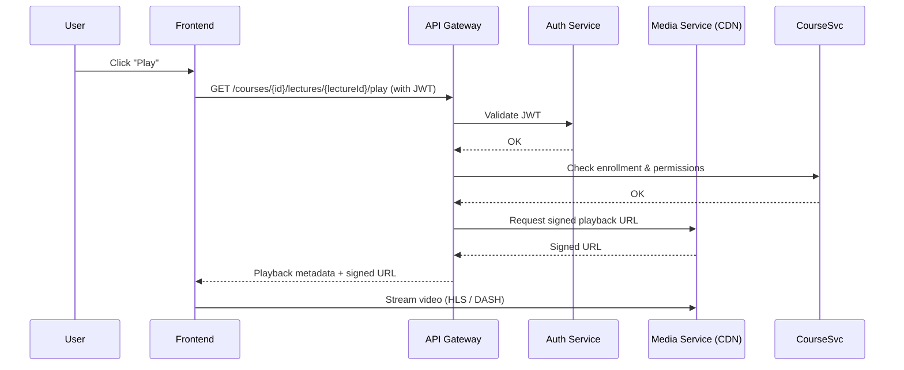
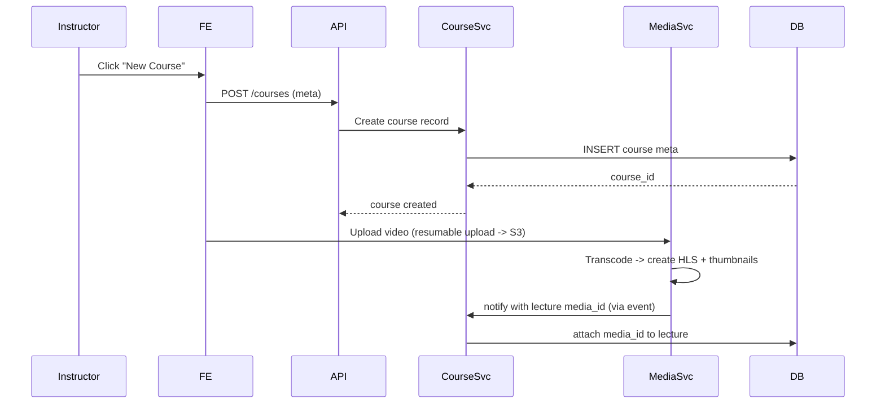
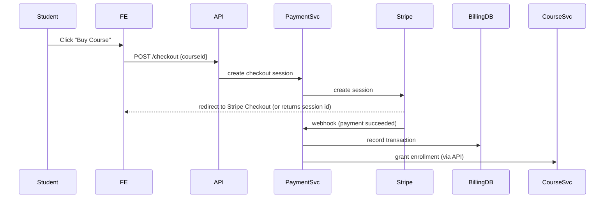
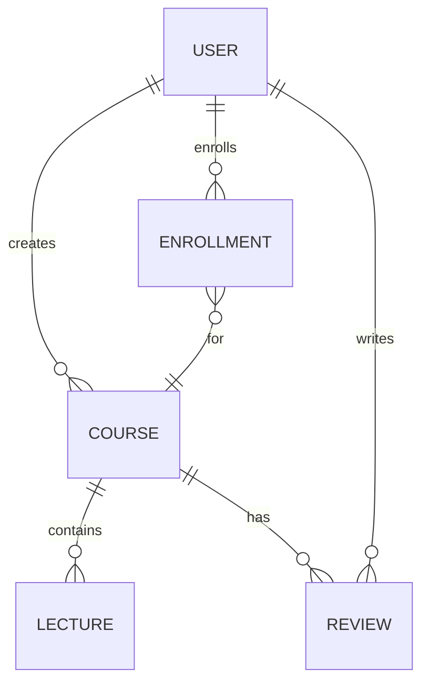
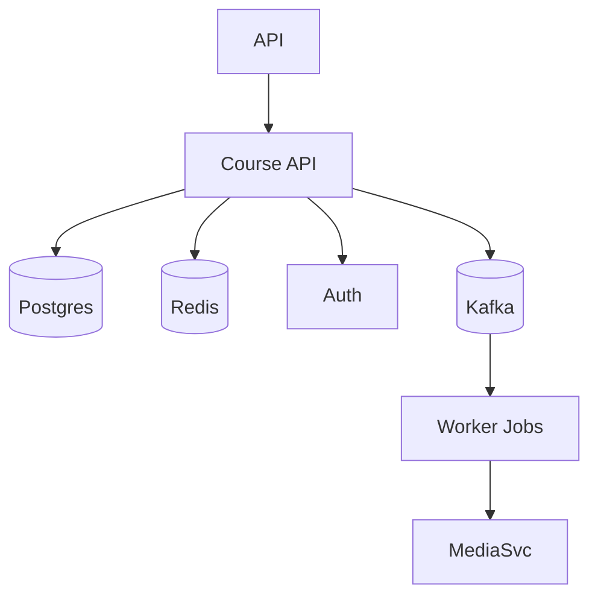
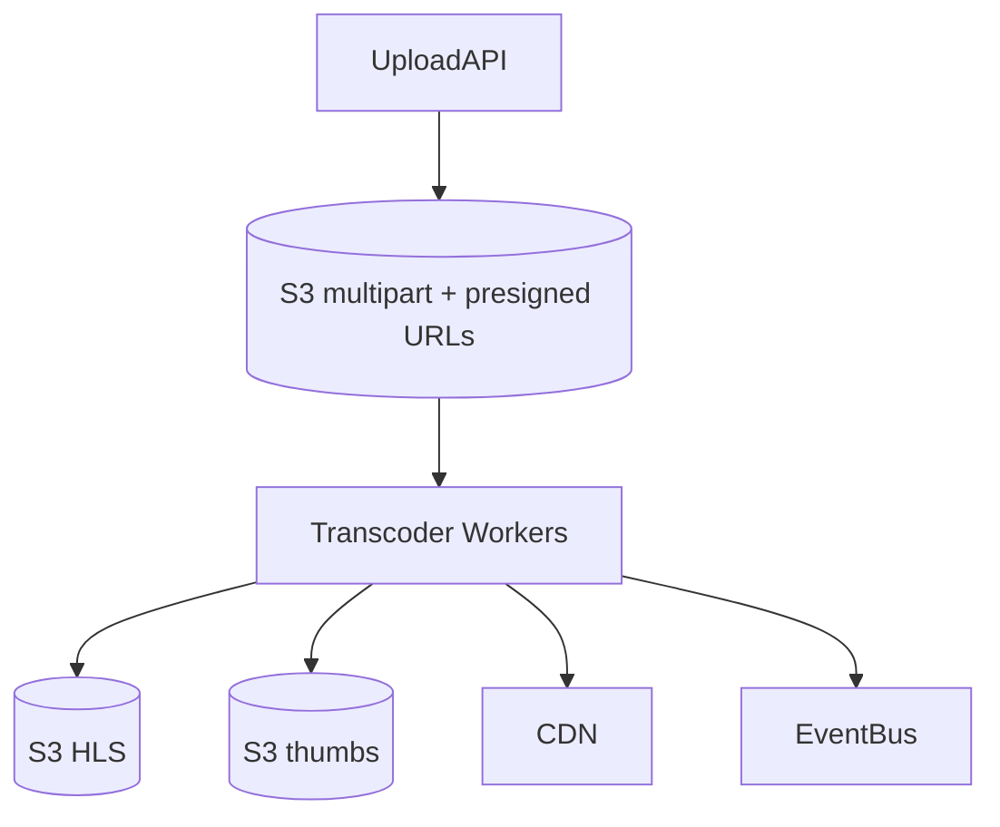
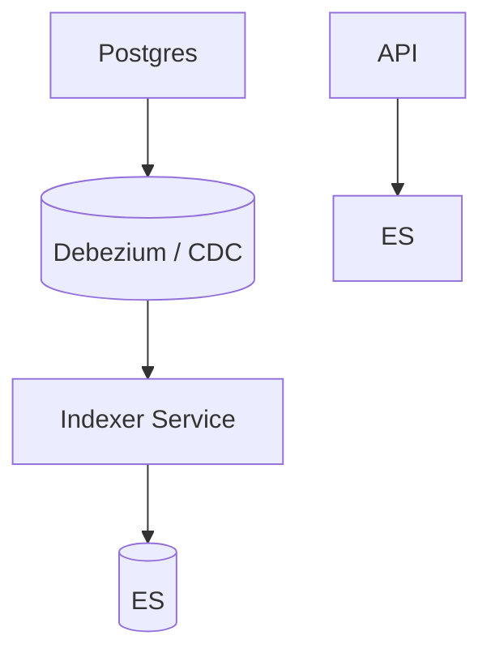

# Visual System Design — EduMaster (Udemy Clone)

This document contains visual system design diagrams (Mermaid) and explanations for each major component of EduMaster: frontend, backend, media storage, search, payments, analytics, admin, and supporting infrastructure.

---

## 1. High-Level Architecture

```mermaid
graph TD
  LB[Load Balancer / CDN] --> FE[Frontend (Next.js / React)]
  LB --> API[GATEWAY / API Layer]
  FE --> API
  API --> Auth[Auth Service (JWT/OAuth)]
  API --> CourseSvc[Course Service]
  API --> MediaSvc[Media Service / CDN]
  API --> PaymentSvc[Payment Service (Stripe)]
  API --> SearchSvc[Search Service (ElasticSearch)]
  API --> UserSvc[User Service / Profiles]
  API --> NotificationSvc[Notification Service]
  API --> AdminSvc[Admin Service]
  API --> Analytics[Analytics / Events]
  CourseSvc --> DB[(Postgres + Prisma)]
  UserSvc --> DB
  CourseSvc --> Redis[(Redis cache)]
  MediaSvc --> S3[(AWS S3 / Cloud Storage)]
  MediaSvc --> CDN[(Video CDN / HLS)]
  SearchSvc --> ES[(ElasticSearch Index)]
  PaymentSvc --> BillingDB[(Payments DB)]
  Analytics --> EventsDB[(Event store / Kafka)]
  NotificationSvc --> EmailSvc[Email provider (SES)]
  Auth --> DB
```

**Notes:** Load balancer + CDN serve static assets and route traffic to frontends and API gateway. API gateway routes to microservices (or monolith modules). Media Service handles video transcoding and storage, using S3 + CDN for delivery. ElasticSearch powers discovery. Redis used for caching and session store. Kafka (or similar) used for event streaming to analytics and async jobs.

---

## 2. Component Responsibilities & Details

### Frontend (Next.js / React)
- Renders course marketplace pages, course player, dashboards, and admin UI.
- SSR for SEO on course pages; CSR for dashboards and player.
- Uses signed URLs to play videos directly from CDN/S3.
- Handles optimistic UI updates, local caching, and offline fallback for progress sync.

**Mermaid - Frontend -> Playback Sequence**



### Backend — API Gateway
- Central routing, authentication check, rate limiting, request aggregation, and response caching.
- Can be implemented with an API Gateway (e.g., Kong, Envoy, or custom Node.js gateway).

### Auth Service
- Handles signup/login, OAuth flows, password reset, and JWT issuance/refresh tokens.
- Stores user credentials and refresh tokens in DB; ephemeral sessions in Redis for fast revoke/blacklist.

### Course Service
- Manages course metadata, sections, lectures, quizzes, resources, and enrollment logic.
- Stores main normalized data in Postgres (Prisma ORM). Uses Redis for hot reads (catalog, top courses).

**Mermaid - Course Creation Flow**



### Media Service
- Handles uploads, virus scanning, transcoding (HLS/DASH, multiple resolutions), thumbnail generation, and storage in S3.
- Publishes events (e.g., `video.transcoded`) so Course Service can mark lectures ready.
- Uses a worker pool (Kubernetes jobs or AWS Lambda) for transcoding or uses a managed service (Elastic Transcoder, MediaConvert).

### Search Service (ElasticSearch)
- Indexes course metadata, instructor profiles, and reviews for full-text search and filters.
- Background job keeps ES index in sync with Postgres via change data capture (CDC) or event bus.

### Payment Service
- Handles checkout sessions, webhooks from provider (Stripe / PayPal), and revenue distribution logic.
- Records transactions in a dedicated billing DB and fires events for accounting/analytics.

**Mermaid - Payment Checkout Flow**



### Notification Service
- Sends transactional emails (signup, receipts, course updates) and in-app notifications; uses SES/SendGrid + push notifications for mobile apps.
- Queues and retries failed deliveries.

### Analytics & Event Stream
- Event-driven architecture: use Kafka / Kinesis to capture events (playback started/completed, quiz results, purchases).
- Consumers populate analytics DB or data warehouse (e.g., Redshift / BigQuery) and feed dashboards / ML features (recommendations).

### Admin Service
- Provides moderation tools for courses, user management, refunds, and reports. Has permissions separate from instructor roles.

---

## 3. Data Model (Simplified)


**Key tables:** `users`, `courses`, `lectures`, `sections`, `enrollments`, `transactions`, `media`, `reviews`, `progress`, `certificates`.

---

## 4. Scaling & Reliability Patterns

- **Autoscaling:** Kubernetes Horizontal Pod Autoscaler for API/services; S3 + CDN for static/video delivery.
- **Caching:** Redis for session store, leaderboard, frequently accessed course metadata, and rate-limiting counters.
- **CDN:** Use global CDN for video streaming (CloudFront, Cloudflare Stream) and signed URLs for access control.
- **Database scaling:** Read replicas for Postgres, partition hot tables (transactions). Use connection pooling (PgBouncer).
- **Async processing:** Use message broker (Kafka or RabbitMQ) for background jobs — transcoding, email, analytics ingestion.
- **Observability:** Centralized logging (ELK/EFK), metrics (Prometheus + Grafana), error tracking (Sentry).
- **Security:** WAF, rate limiting, secure headers, input validation, encryption at rest/in transit, token revocation paths.

---

## 5. Operational Playbooks (short)

- **Deploy new release:** Blue/green or Canary via Kubernetes + Helm; run DB migrations with caution (backups + versioned migrations).
- **Incident - Video not playing:** Check CDN status, signed URL expiry, media service worker queue, transcoding success event.
- **Incident - Payment webhook failure:** Replay from payment provider logs; verify webhook secret; check idempotency in Payment Service.

---

## 6. Component Diagrams (One-page summaries)

### A. Course Service (internal components)


### B. Media Service (internal components)


### C. Search Indexer


---

## 7. Security Considerations (short list)
- Signed short-lived URLs for video playback.
- Use refresh tokens with rotation and refresh token revocation support.
- Validate webhooks with provider signatures; use idempotency keys for payments.
- Sanitize uploads and run virus scans on resources.
- RBAC for admin/instructor/student roles; least privilege for services.

---

## 8. Recommendations & Next Steps
1. Start with a modular monolith (single repo, separated modules) if team is small. Move to microservices when traffic/teams grow.
2. Prioritize: Auth, Course CRUD, Media upload & playback, Enrollment, Payments for MVP.
3. Implement observability and logging from day 1 (Prometheus, Grafana, Sentry).
4. Add integration tests for payment flows, video playback (signed URL tests), and course creation webhooks.

---

*If you'd like, I can:*
- Export this document as a downloadable `.md` file (with the Mermaid diagrams included).  
- Generate PNG/SVG diagrams for each Mermaid graph. (I can create static images if you prefer.)

