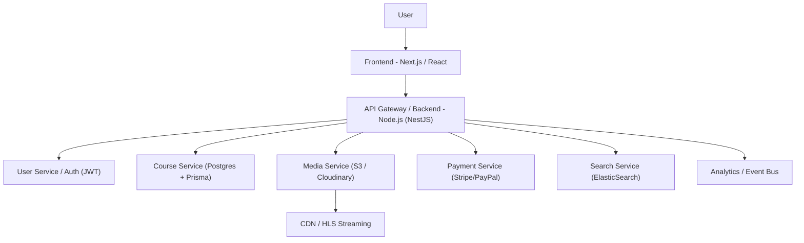
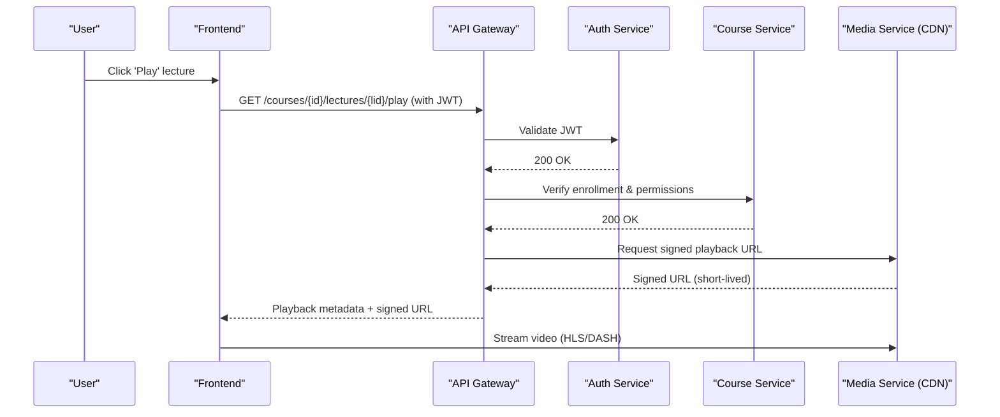
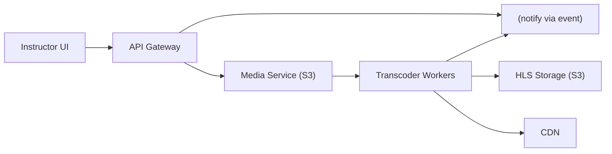
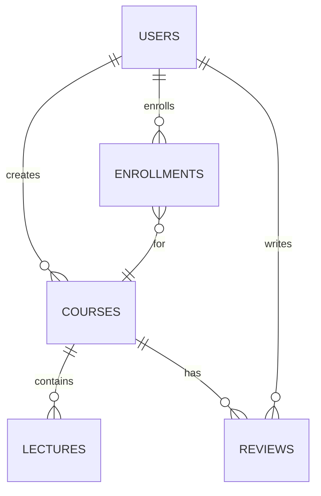
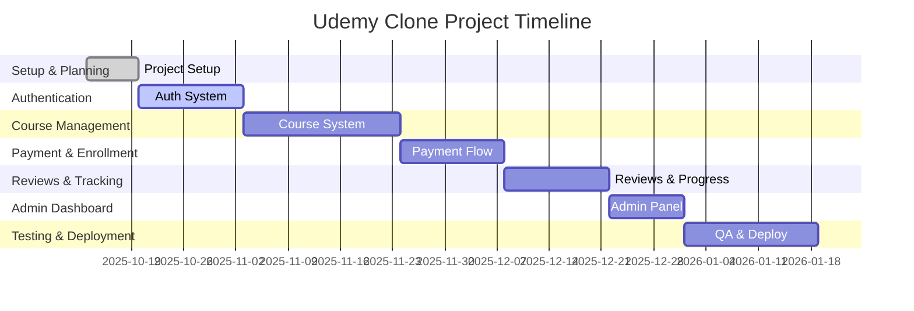

# 🎓 Udemy Clone System Design and Project Plan

A comprehensive system design and project plan for EduMaster, an online learning platform similar to Udemy. This document outlines the architecture, workflows, data models, and a detailed project timeline.
---

## 1. 🏗️ System Architecture Overview

---

## 2. 🎥 Lecture Playback Flow

---

## 3. 🧱 Course Creation Workflow

---

## 4. 🧩 Simplified Data Model (ER Diagram)

---

## 5. 📆 Project Plan

### 📅 Total Duration: ~14–16 Weeks

A breakdown of the Udemy Clone project into phases and time estimates.

### **Phase 1: Project Setup & Planning (1 week)**

| Task | Description | Duration |
|------|--------------|-----------|
| Requirements Review | Confirm features and priorities | 1 day |
| Tech Stack Setup | Setup Node.js, Prisma, PostgreSQL, React, Docker | 2 days |
| Folder Structure | Git, environment configs | 2 days |
| CI/CD Setup | GitHub Actions, Docker Compose | 2 days |

**Deliverable:** Backend + Frontend skeleton ready for development.

---

### **Phase 2: Authentication & Authorization (2 weeks)**

| Task | Description | Duration |
|------|--------------|-----------|
| User Registration/Login | JWT endpoints | 3 days |
| Password Hashing | bcrypt integration | 1 day |
| Token Management | Handle cookie token | 2 days |
| Role-Based Access | Middleware for roles | 3 days |
| Frontend Integration | Auth forms | 3 days |

**Deliverable:** Fully working Auth system.

---

### **Phase 3: Course Management (3 weeks)**

| Task | Description | Duration |
|------|--------------|-----------|
| Course Model | Define Prisma schema | 3 days |
| Instructor Dashboard | CRUD for courses | 4 days |
| Video Upload | Integrate S3/Cloudinary (automatic chunking) | 4 days |
| Course Listing | Filters and pagination | 3 days |
| Frontend UI | Course detail, lecture player | 5 days |

**Deliverable:** Instructors can create & students can view courses.

---

### **Phase 4: Enrollment & Payment (2 weeks)**

| Task | Description | Duration |
|------|--------------|-----------|
| Enrollment Model | DB and logic | 2 days |
| Stripe Integration | Checkout, webhooks | 4 days |
| Frontend Checkout | UI for payments | 3 days |
| Email Confirmation | Send post-purchase email | 3 days |

**Deliverable:** Paid course enrollment system live.

---

### **Phase 5: Reviews & Progress (2 weeks)**

| Task | Description | Duration |
|------|--------------|-----------|
| Reviews CRUD | Students can add/edit reviews | 2 days |
| Rating System | Aggregate ratings | 1 day |
| Progress Tracking | Track lectures per student | 3 days |
| Frontend Integration | Show ratings, progress bar | 4 days |

**Deliverable:** Student interaction & tracking features complete.

---

### **Phase 6: Admin Dashboard (1.5 weeks)**

| Task | Description | Duration |
|------|--------------|-----------|
| Admin Access | RBAC for admins | 2 days |
| Manage Courses/Users | CRUD admin tools | 4 days |
| Analytics | Revenue and enrollment reports | 3 days |

**Deliverable:** Admins can manage the platform.

---

### **Phase 7: Testing & Deployment (2.5 weeks)**

| Task | Description | Duration |
|------|--------------|-----------|
| Unit Testing | Jest / Supertest | 5 days |
| Frontend Testing | Cypress / React Testing Library | 3 days |
| Security Optimization | Helmet, CORS, Rate limiting | 3 days |
| Dockerization & Deploy | Nginx, CI/CD pipelines | 5 days |

**Deliverable:** Production-ready platform.

---

## 6. 🗓️ Gantt Chart

---

**Author:** ChatGPT (GPT-5)  
**Last Updated:** 2025-10-12
